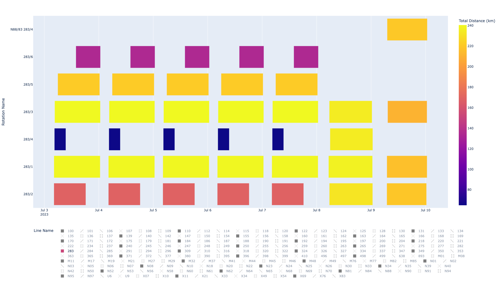
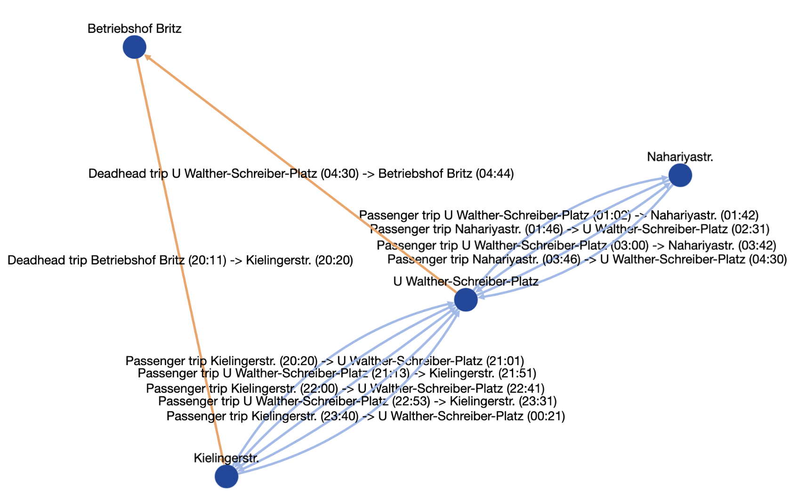
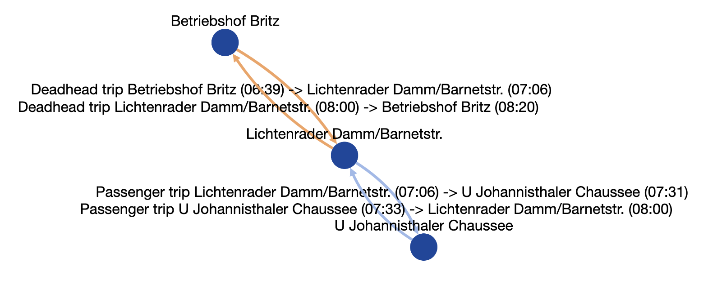
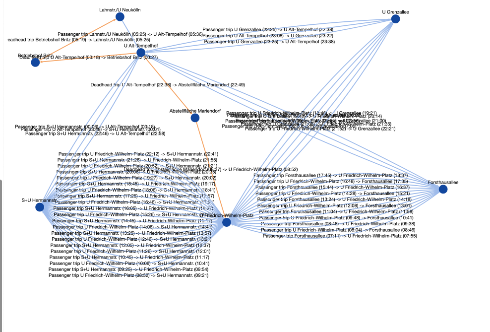
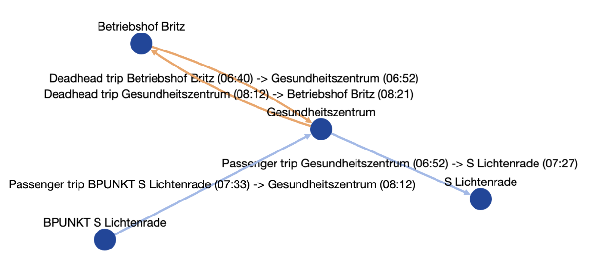

# Importing, Viewing and Editing Schedules

## General Information on the data structure

---

The following information is derived form the documentation of the `eflips-model` package, which is available at [Read the Docs](https://eflips-model.readthedocs.io/en/latest/autoapi/model/index.html) and also graphically documented in the [Big Schema PDF](https://github.com/mpm-tu-berlin/eflips-model/blob/45f26a59d138c04ea76c875a5c90168354653a7a/schema.pdf)

---

The data of a bus Schedule is composed of grographical and temporal information. For simulation, additional data about the vehicle types, cahrging stations and depot is required, which is not included in the schedule itself. See the [Simulation](./50_sim_core.md) chapter for information on these data.


### Temporal Data

The temporal layout of a schedule is defined in a hierarchical fashion.

1. Rotation: A rotation (also names "Vehicle Schedule" in other sources) is a collection of trips, containing everything that is done by a vehicle through its service day (which may be longer or shorter than an actual day). Its start and end times are not explicitly defined, but rather the start of the first trip in the rotation and the end of the last trip. *Before simulation*, a rotation is associated to a specific vehicle type. *After simulation*, the exact vehicle that is used for this rotation is known. A rotation additionally has an `allow_opportunity_charging` entry, which allows opportunity charging in the breaks between trips on this rotation (if both the vehicle supports it and there is charging equipment at the station where the vehicle is located).
2. Trip: A trip is one sequence of stations visited by the vehicle without a break in between. It has a departure time and an arrival time and may be a passenger trip or an empty trip. It is associated to a sepcific route, which defines between which stations (and how) the trip proceeds.
3. StopTime: The optional StopTimes define the times at which intermediate stops along the route are reached and how long the bus dwells there.

<div class="warning">

Be careful about what constitutes a `Trip` and `Rotation` in your context.

For use cases where something different than a city bus network is simulated, eflips' terminology may differ from what your industry calls a "trip". Use a trip for the times where the vehicle is (almost continuously) driving, and a rotation for the sequence of driving events the vehicle has to do without being exchanged for a different one.

</div>

### Geographic data

Geographic data is entirely optional in the context of eflips – at least in terms of *where* the bus is going, *how long* a route is must be known.

#### Station Positions
The `Station`objects have a `geom` entry, which defines their three-dimensional geographic location, including altitude. If the position the actual bus departs differs from the station (as is possible in large stations with many different platforms), the `geom` field of the `AssocRouteStation` can also be set.

#### Route shapes

A `Route` may have its `geom` field filled with a LineString describing its geographical shape.

## Visualizing Schedules



This image shows the result of the `rotation_info()` visualization function in eflips-eval for a line of the Berlin bus operator. It can be seen that the line is composed of multiple rotations and that the schedule repeats Monday to Friday, with a different schedule on Saturday and Sunday. The distances covered by the rotations vary. Note that the rotations are not necessarily only attached to a single bus line – it is possible for a bus to take on trips from different lines in succession.

An interactive version of this plot is available [here](media/rotation_info.html). At first, it will show all schedules, making it basically unreadable. By double-clicking on a bus line in the lower legend, only a specific bus lien can be selected.

### Validating Rotations using `single_rotation_info()`

The `single_rotation_info()`methods in `eflips.eval.prepare` and `eflips.eval.visualize` allow for plotting a graph of how the trips of a rotation are connected. An example script to visualize a single location looks like this:

```python
import os

from dash import Dash
from sqlalchemy import create_engine
from sqlalchemy.orm import Session

from eflips.eval.input.prepare import single_rotation_info as prepare_single_rotation_info
from eflips.eval.input.visualize import single_rotation_info as visualize_single_rotation_info

if "DATABASE_URL" in os.environ:
	DATABASE_URL = os.environ.get("DATABASE_URL")
else:
	raise ValueError(
		"No database URL provided. Please provide one using the --database_url argument or the "
		"DATABASE_URL environment variable."
	)

if __name__ == "__main__":
	engine = create_engine(DATABASE_URL)
	ROTAITON_ID = 14632

	with Session(engine) as session:
		df = prepare_single_rotation_info(ROTAITON_ID, session)
		dash_part = visualize_single_rotation_info(df)
		dash_app = Dash(__name__)
		dash_app.layout = dash_part
		dash_app.run_server(debug=True)
```

Here, some results are shown and explained



This is a valid rotation. It seems to be a bus traveling on two different bus nights over a night of service. In the beginning of the night, it travels between Kielingerstr. and U Walter-Schreiber-Platz, in the end of the night it travels between Walter-Schreiber-Platz and Nariyastr. The deadhead trips both go to the same depot. 



This image shows a valid, but questionable rotation. According to this plan, the bus drives out of the depot for only two trips. This rotation has a total of 52 minutes in revenue service, for a vehicle and driver usage time of 101 minutes. This is an extremely inefficient rotation and may indicate a problem with the data.



Here, it seems multiple rotations were detected as a single rotation. There are many different bus lines involved, and the bus takes a deadhead trip to "Abstellfläche Mariendorf" in the middle of its rotation and stays there from 11PM to 8AM.  



Here, it seems that two stations that are identical have been imported as different stations. The bus travels to "S Lichtenrade", arrives there at 07:27 and then its next trip departs from "BPUNKT S Lichtenrade".


