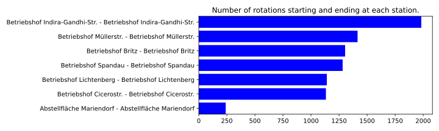

# Fixing up the Schedule Data

In the [import chapter](./20_import.md) we have imported the schedule into the database, and investigated it for rough errors. However, even if all the rotations are consistent, it may still contain three types if issues that need to be fixed before simulation.

## Choosing which Rotations to simulate

### By Vehicle Type

---

The code for this section can also be found in [this Jupyter Notebook](https://github.com/mpm-tu-berlin/eflips-book/blob/main/31_fixing_data_vehicle_types.ipynb).

---

The following code fragment will show the number of roations for each vehicle type.

```python
# You will need to load the database URL from the environment variables
engine = create_engine(DATABASE_URL)
session = Session(engine)

vehicle_types = session.query(VehicleType).filter(VehicleType.scenario_id == SCENARIO_ID).all()

result_dict = {}
for vt in vehicle_types:
	count = session.query(Rotation).filter(Rotation.vehicle_type_id == vt.id).count()
	result_dict[vt] = count

# Order by number of rotations
sorted_results = sorted(result_dict.items(), key=lambda x: x[1], reverse=True)
for vt, count in sorted_results:
	print(f"{vt.name} (ID: {vt.id}): {count}")
```

For all BVG data (BVG scenario 1) the output is as follows:

```
Auto-Generated by XML Importer for GN (ID: 3): 5480
Auto-Generated by XML Importer for EN (ID: 1): 2601
Auto-Generated by XML Importer for EED (ID: 6): 948
Auto-Generated by XML Importer for DL (ID: 4): 896
Auto-Generated by XML Importer for EED-40 (ID: 5): 271
Auto-Generated by XML Importer for CKB (ID: 2): 118
Auto-Generated by XML Importer for GEG (ID: 9): 101
Auto-Generated by XML Importer for MN (ID: 10): 24
Auto-Generated by XML Importer for EE (ID: 7): 14
Auto-Generated by XML Importer for D (ID: 8): 7
```

For other transport operators, the definitions might differ. For BVG, the [Berlin Bus Heritage Club](https://www.traditionsbus.de/Fahrzeuge/typologie.htm) maintains a web site specifying what the abbreviations mean. In the BVG context, the GN and GEG (articulated buses, diesel and electric), EN, EED, EED-40 and EE (electric and conventional single deckers) and the DL (double decker long) buses are of relevance. 

So we remove all rotations by other vehicle types.

```python
# Remove all rotations by the vehicle types we don't want to keep
vehicle_type_ids_to_remove = [2, 10, 8]
for vt_id in vehicle_type_ids_to_remove:
	rotations_for_vt = session.query(Rotation).filter(Rotation.vehicle_type_id == vt_id).all()
	for rotation in rotations_for_vt:
		for trip in rotation.trips:
			for stop_time in trip.stop_times:
				session.delete(stop_time)
			session.delete(trip)
		session.delete(rotation)
	session.query(VehicleType).filter(VehicleType.id == vt_id).delete()
	session.commit()
```

Finally, we want to assign proper electric vehicles to all rotations, in order to simulate a fully electrified network. Here, talking to your bus operator about their strategies is recommended. What bus types do they operate? For BVG, we will be selecting one bus type for each major Vehicle Class:

- The Single deckers will be represented by an "Ebusco 3.0 12"
- The articulated buses will be represented by a "Solaris Urbino 18"
- The Double deckers will be represented by an "Alexander Dennis Enviro500EV"

If more vehicle types – and especially multiple different vehicle types for the same general "class" of vehicle (say newer and older electric buses) - will be used, you will need to make a decision on how to assign these. This is a complex optimization problem and not covered at the moment. 

In out case, the new vehicle types are created

```python
# Create three new vehicle types. One single, one double, and a long bus.
single_decker = VehicleType(name="Ebusco 3.0 12", 
							scenario_id=SCENARIO_ID,
							name_short="SB", 
							battery_capacity=500.0,
							battery_capacity_reserve=0.0,
							charging_curve=[[0, 1], [300, 300]],
							opportunity_charging_capable=True,
							minimum_charging_power=10,
							length=12.0,
							width=2.55,
							height=3.19,
							empty_mass=9950
							)
session.add(single_decker)

bendy_bus = VehicleType(name="Solaris Urbino 18",
							scenario_id=SCENARIO_ID,
							name_short="GN",
							battery_capacity=800.0,
							battery_capacity_reserve=0.0,
							charging_curve=[[0, 1], [300, 300]],
							opportunity_charging_capable=True,
							minimum_charging_power=10,
							length=18.0,
							width=2.55,
							height=3.19,
							empty_mass=19000
							)
session.add(bendy_bus)

double_decker = VehicleType(name="Alexander Dennis Enviro500EV",
							scenario_id=SCENARIO_ID,
							name_short="DD",
							battery_capacity=472,
							battery_capacity_reserve=0.0,
							charging_curve=[[0, 1], [300, 300]],
							opportunity_charging_capable=True,
							minimum_charging_power=10,
							length=12.0,
							width=2.55,
							height=4.3,
							empty_mass=16000
							)
session.add(double_decker)  
```

And assigned to the rotations

```python
session.flush() # Necessary to get the IDs of the new vehicle types
vehicle_type_ids_single_decker = [1, 6, 5, 7]
vehicle_type_ids_double_decker = [4]
vehicle_type_ids_bendy_bus = [3, 9]
vehicle_id_updates = {single_decker.id: vehicle_type_ids_single_decker,
						double_decker.id: vehicle_type_ids_double_decker,
						bendy_bus.id: vehicle_type_ids_bendy_bus}  
					  

for new_id, old_ids in vehicle_id_updates.items():
	for old_id in old_ids:
		rotations_for_vt = session.query(Rotation).filter(Rotation.vehicle_type_id == old_id)
		rotations_for_vt.update({"vehicle_type_id": new_id})
		session.query(VehicleType).filter(VehicleType.id == old_id).delete()
```

Now, when we run the analysis code again, we get the following result:
```
Solaris Urbino 18 (ID: 99): 5581
Ebusco 3.0 12 (ID: 98): 3834
Alexander Dennis Enviro500EV (ID: 100): 896
```

The vehicle types have been updated correctly.

### By start/end depot

We will want to check if the previous cleanup of the schedule data was successful. Specifically, we want to see if 

- there are rotations which end at a different place than where they startet. These, we can't simulate at all.
- there are rotations starting/ending at places we don't care about for out electrification scenario. Generally, it makes sense to simulate a complete bus network, especially when things such as terminus charging are concerned (as the economics of building a charging station will change when it is utilized by buses from multiple depots). Still, some rotations might be excluded. *Also, this is a good place to check your data quality. If rotations start/end at weird places, maybe something is wrong with the data?*

Using the script `32_fixing_data_depots_to_simulate.ipynb`, we can investigate where each rotation starts and ends. 


In this example, there is still a large amount of "inavlid-looking" start/end startions, as it is not reasonable that such a large number of depots exist (also, the most popular start/end startions are named "Betriebshof" or "Abstellfläche", while the other stops seem to be regular stops). While work remains in progress to fix the data import properly, we first reduce our data set to the following 7 depots

- Betriebshof Indira-Gandhi-Straße
- Betriebshof Müllerstraße
- Betriebshof Britz
- Betriebshof Spandau
- Betriebshof Lichtenberg
- Betriebshof Cicerostraße
- Abstellfläche Mariendorf

This decision is based on communication with the bus operator, who confirmed that "Betriebshof A" is a mistake in the data, and that "Abstellfläche Mariendorf" should be regarded as a depot. "Abstellfläche ehemelaiger Flughafen Tegel" is only used for rail replacement service temporarily and will not be relevant in the long term.

We now remove all the Rotations that do not belong to one of these stations.



This looks much more reasonable.

### By time

Using the `rotation_info()` method from the `eflips-eval` package, we can visualize the remaining rotations. This figure can be interactively explored [here](media/scenario_1_reduced_rotations.html). While there is still an incredibly high number of roations remaining, the weekly pattern of monday to friday beind identical, with saturday and sunday being different can be observed. 

eFLIPS is capable of simulating arbitrary time intervals. For the purpose of planning, a one-week interval usually makes the most sense. However, a one-day interval can also be used and has improved performance, since only 1/7th of the total rotations need to be simulated.

Using the following code, we temporally reduce our rotations to a 24-hour period around Tuesday, July 4, 2024. 

```python
# Obtain a "local midnight" for the scenario
tz = pytz.timezone("Europe/Berlin")
date = date(2024, 7, 4)
midnight = tz.localize(datetime(date.year, date.month, date.day))

# Reduce the scenario to one day
scenario = session.query(Scenario).filter(Scenario.id == SCENARIO_ID).one()
scenario.select_rotations(session, midnight, timedelta(days=1))
```

Note that the total period of the schedule (interactively visualized [here](media/scenario_1_final_rotations.html)) is still greater than 24 hours, as some of the rotations that start shortly before midnight run until after midnight. Its *repetition period*, however is 24 hours.

## Correctly assigning vehicle types