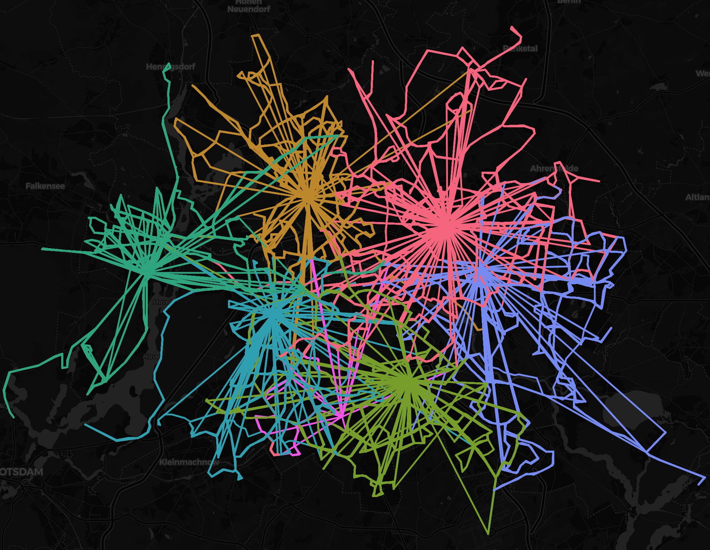

# Assigning Schedules to Depots using `eflips-opt`

The `eflips-opt` package allows the reassigning of rotations to the depots, taking into account their capacity and trying to minimze total deadhead time. It works by removing all deadhead trips from the start and end of existing rotations and then using linear programming in order to identify the globally optimal depot assignment.

With this method, new depots being added (and the corresponding shift in roations between the depots) and depots being removed (for example to simulate the electrification at a depot not being completed on schedule) can be represented in the eflips world. 

It should be noted that "rotation reassignment", e.g. assigning rotations to new depots without changing the passenger trips they are composed of is a rather peculiar use case. Usually, a significant restructuring of the bus network would lead to the creation of entirely *new* rotations by solving the "multi-depot electric vehicle scheduling problem".

## Visualizing the current state

The figure above shows which depots currently serve which area in Berlin (it can be interactively explored [here](media/geographic_trip_plot.html).

## Optimizing the assignment

For our optimization, we will be making the following assumptions:

- "Abstellfläche Mariendorf" will not be equipped with charging infrastructure, therefore it cannot serve as a depot for electrified buses
- There will be a new depot "Köpenicker Landstraße" at the coordinates 52.4654085,13.4964867 with a capacity of 200 12m buses
- There will be a new depot "Rummelsburger Landstraße" at the coordinates "52.4714167,13.5053889" with a capacity of 60 12m buses
- There will be a new depot "Säntisstraße" at the coordinates "52.416735,13.3844563" with a capacity of 230 12m buses
- There will be a new depot "Alt Friedrichsfelde" at the coordinates "52.5123056,13.5401389" with a capacity of 135 12m buses
- The capacity of the existing depot "Spandau" will be 220 12m buses
- The capacity of the existing depot "Indira-Gandhi-Straße" will be 300 12m buses
- The capacity of the existing depot "Britz" weill be 140 12m buses
- The capacity of the existing depot "Cicerostraße" will be 209 12m buses
- The capacity of the existing depot "Müllerstraße" will be 155 12m buses
- The capacity of the existing depot "Lichtenberg" will be 120 12m buses

