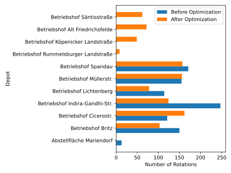

# Assigning Schedules to Depots using `eflips-opt`

<div class="warning">

While `eflips-opt` is AGPLv3-licensed free software, it requires interfacing with the following services:

- A [Gurobi](https://www.gurobi.com/academia/academic-program-and-licenses/) (later also [GAMS](https://www.gams.com/sales/pricing_academic/)) closed-source linear programming solver
- An [OpenRouteService](https://openrouteservice.org/) instance to calculate the routes for the new depot trips. It can be installed locally using [Docker](https://giscience.github.io/openrouteservice-workshop/workshop/docker.html), or they offer a (rate-limited) [API](https://openrouteservice.org/dev/#/api-docs). The software could be adapted to use a routeing provider of your choice or possibly the straight-line distance.s

</div>

The `eflips-opt` package allows the reassigning of rotations to the depots, taking into account their capacity and trying to minimze total deadhead time. It works by removing all deadhead trips from the start and end of existing rotations and then using linear programming in order to identify the globally optimal depot assignment.

With this method, new depots being added (and the corresponding shift in roations between the depots) and depots being removed (for example to simulate the electrification at a depot not being completed on schedule) can be represented in the eflips world. 

It should be noted that "rotation reassignment", e.g. assigning rotations to new depots without changing the passenger trips they are composed of is a rather peculiar use case. Usually, a significant restructuring of the bus network would lead to the creation of entirely *new* rotations by solving the "multi-depot electric vehicle scheduling problem".

## Visualizing the current state


The figure above shows which depots currently serve which area in Berlin (it can be interactively explored [here](media/geographic_trip_plot.html). It is generated using `eflips.eval.prepate.geographic_trip_plot()` and `eflips.eval.visualize.grographic_trip_plot()`

## Optimizing the assignment

For our optimization, we will be making the following assumptions:

- "Abstellfläche Mariendorf" will not be equipped with charging infrastructure, therefore it cannot serve as a depot for electrified buses
- There will be a new depot "Köpenicker Landstraße" at the coordinates 52.4654085,13.4964867 with a capacity of 200 12m buses
- There will be a new depot "Rummelsburger Landstraße" at the coordinates "52.4714167,13.5053889" with a capacity of 60 12m buses
- There will be a new depot "Säntisstraße" at the coordinates "52.416735,13.3844563" with a capacity of 230 12m buses
- There will be a new depot "Alt Friedrichsfelde" at the coordinates "52.5123056,13.5401389" with a capacity of 135 12m buses
- The capacity of the existing depot "Spandau" will be 220 12m buses
- The capacity of the existing depot "Indira-Gandhi-Straße" will be 300 12m buses
- The capacity of the existing depot "Britz" weill be 140 12m buses
- The capacity of the existing depot "Cicerostraße" will be 209 12m buses
- The capacity of the existing depot "Müllerstraße" will be 155 12m buses
- The capacity of the existing depot "Lichtenberg" will be 120 12m buses

In Python, the new capacities should be specified as a dictionary containing the following keys:

- "depot_station": Either the ID of the existing station or a (lon, lat) tuple for a depot that does not yet exist in the database
- "capacity": The new capacity of the depot, in 12m buses
- "vehicle_type": A list of vehicle type ids that can be used at this depot
- "name": The name of the depot (only for new depots)

This example code generates such a list, for the BVG database. The depot station IDs will need to be looked up manually, for example the dataframe from the `eflips.eval.prepate.geographic_trip_plot()` contains these IDs.

```python
depot_list: List[Dict[str, Dict[str, Union[int, Tuple[float, float], List[int]]]]] = []
all_vehicle_type_ids = session.query(VehicleType.id).filter(VehicleType.scenario_id == SCENARIO_ID).all()
all_vehicle_type_ids = [x[0] for x in all_vehicle_type_ids]

# "Abstellfläche Mariendorf" will have a capacity of zero
depot_list.append({
	"depot_station": 103159411,
	"capacity": 0,
	"vehicle_type": all_vehicle_type_ids
})

# "Betriebshof Spandau will hava a capacity of 220
# "Abstellfläche Mariendorf" will have a capacity of zero
depot_list.append({
	"depot_station": 103109411,
	"capacity": 220,
	"vehicle_type": all_vehicle_type_ids
})

# "Betriebshof Indira-Gandhi-Straße" will have a capacity of 300
depot_list.append({
	"depot_station": 150518,
	"capacity": 300,
	"vehicle_type": all_vehicle_type_ids
})

# "Betriebshof Britz" will have a capacity of 140
depot_list.append({
	"depot_station": 80181,
	"capacity": 140,
	"vehicle_type": all_vehicle_type_ids
})

# "Betriebshof Cicerostraße" will have a capacity of 209
depot_list.append({
	"depot_station": 103109407,
	"capacity": 209,
	"vehicle_type": all_vehicle_type_ids
})

# "Betriebshof Müllerstraße" will have a capacity of 155
depot_list.append({
	"depot_station": 103109408,
	"capacity": 155,
	"vehicle_type": all_vehicle_type_ids
})

# "Betriebshof Lichtenberg" will have a capacity of 120
depot_list.append({
	"depot_station": 160522,
	"capacity": 120,
	"vehicle_type": all_vehicle_type_ids
})

# "Betriebshof Köpenicker Landstraße" will have a capacity of 200
depot_list.append({
	"depot_station": (13.4964867, 52.4654085),
	"name": "Betriebshof Köpenicker Landstraße",
	"capacity": 200,
	"vehicle_type": all_vehicle_type_ids
})

# "Betriebshof Rummelsburger Landstraße" will have a capacity of 60
depot_list.append({
	"depot_station": (13.5053889, 52.4714167),
	"name": "Betriebshof Rummelsburger Landstraße",
	"capacity": 60,
	"vehicle_type": all_vehicle_type_ids
})

# "Betriebshof Säntisstraße" will have a capacity of 230
depot_list.append({
	"depot_station": (13.3844563, 52.416735),
	"name": "Betriebshof Säntisstraße",
	"capacity": 230,
	"vehicle_type": all_vehicle_type_ids
})

# "Betriebshof Alt Friedrichsfelde" will have a capacity of 135
depot_list.append(
	{
		"depot_station": (13.5401389, 52.5123056),
		"name": "Betriebshof Alt Friedrichsfelde",
		"capacity": 135,
		"vehicle_type": all_vehicle_type_ids,
	}
)
```

The optimization can then be run using the following commands.

```python
# # Intialize the Optimizer
optimizer = DepotRotationOptimizer(session, SCENARIO_ID)
optimizer.get_depot_from_input(depot_list)

# The optimizer requires a "BASE_URL" environment variable to be set. This should be the URL of the API server for the openrouteservice instance that the optimizer will use.
os.environ["BASE_URL"] = "http://mpm-v-ors.mpm.tu-berlin.de:8080/ors/"
optimizer.data_preparation()
optimizer.optimize()
optimizer.write_optimization_results(delete_original_data=True)
```

With `fig = optimizer.visualize()` a Sankey diagram of the assignment changes can be generated.


Additionally, a bar plot shows the change in rotations handled by each depot.



<div class="warning">

Note that at this point we do not know the exact *vehicle counts* at each depot yet. While `eflips-opt` is trying to approximate vehicle counts using a well-designed heuristics, the actual number of vehicles required can only be found out after the depot has been simualted, as it is influenced by charging duration, parking layout blockages and other depot-specific factors.

</div>
