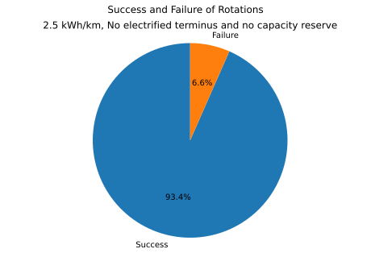

# Creating a feasible network

In the previous steps, we have [imported the data](20_import.md), [identified our types of electric buses](31_fixing_data.md) and [assigned schedules to depots](32_eflips_opt.md). Now, we start with the simulation of the electric bus network. The first step will just utilize the "consumption" simulation, finding out how high the energy consumption outside of the depot is. We will utilize the advanced consumption simulation form the `django-simba` package, which is able to use lookl-up-tables in order to estimate the varying energy consumption over different speeds, levels of load and outside temperatures. Running only the consumption simulation for a given scenario can be done as follows:

```
from ds_wrapper import DjangoSimbaWrapper

# We ignore the UserWarnings, as they are not relevant for running it this way (I know this cause I put them there myself)
warnings.simplefilter("ignore", category=UserWarning)

# We will need to commit and expire the session before and after the DjangoSimbaWrapper, respectively.
# This is because the DjangoSimbaWrapper accesses the database in its own (Django) session.
# So we need to first write the changes to the database and then tell the SQLAlchemy session that
# the data has changed.
session.commit()
ds_wrapper = DjangoSimbaWrapper(DATABASE_URL)
ds_wrapper.run_simba_scenario(SCENARIO_ID, assign_vehicles=True)
del ds_wrapper
session.commit()
session.expire_all(
```

There will be multiple warnings emitted. These exist because we don't have any consumption data yet. At a later time, this book will be updated to run this part with consumption data.

We can now investigate how many rotations fall below 0% SoC.



This looks rather good already. There are some rotations that cannot be electrified with this energy consumption, but most are fine. In order to fix the remaining rotations, two choices can be made

- One of the terminus stations along this rotation can be electrified.
- The rotation can be split into two rotations, thereby reducing the needed battery capacity.

Which of these strategies is best depends on multiple factors. Here, we will explore the tradeoff between the number of terminus stations and split rotations, and pick two scenarios tending to one or the other direction going forward.

## Exploring the tradeoff between adding rotations and adding charging stations

---

The code for this section is  available [here](https://github.com/mpm-tu-berlin/eflips-book/blob/main/61_rotation_optimization.py)

---

The algorithm used to find the different scenarios is a directed random walk, where each time the scenario is still not completely feasible, either a terminus station is electrified or a rotation is split. Going multiple times, with a different probability of electrifying a terminus or splitting a rotation in each step allows a mapping of the pareto frontier. This is not paritcularly elegant way to go about this problem (genetic algorithms would be better), but it works.

